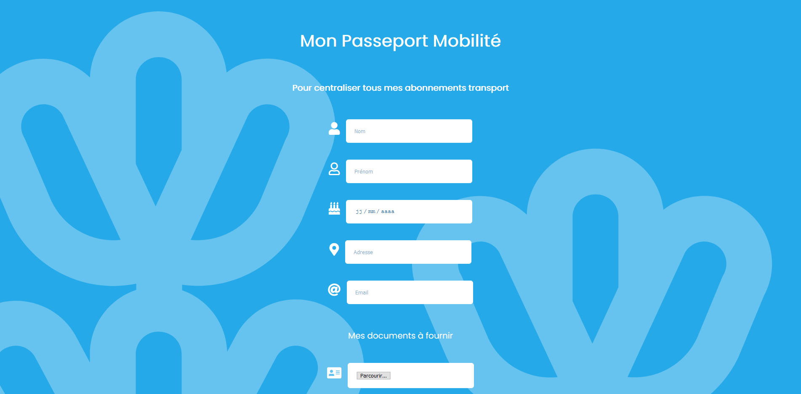

### Live version [here](https://virginiebouvarel.github.io/projets_perso/calculator/).

# Hackathon du Frioul - 8 et 9 Octobre 2019

## Détails

> Technos utilisées : HTML/CSS

Pour ce projet il s'agissait de concevoir une fonctionnalité pour l'application marcel.mobi développée spécialement pour le hackathon. 
Chaque équipe était composée de personnes de différents niveaux (de 15 jours d'école à 1 an d'expérience back-end), venant de différentes écoles et maîtrisant différentes technos. J'ai travaillé avec: Abdelkrim Barkaoui (Wild code school java), Jaoud Assabour (Wild Code School java) et Sébastien Berthier (Simplon) auprès desquels je représentais la 3W Academy Marseille. Nous avons choisi de réaliser un "passeport mobilité".  
Cette fonctionnalité avait pour but de centraliser les possibilités d'abonnements à différents transports pour un même utilisateur au même endroit (location de trotinette éléctrique, de voitures éléctriques...) en simplifiant les démarches et la gestion des documents à fournir.
Nous avons réparti les tâches en fonction des compétences de chacun. Les collègues en formation java ont réalisé le backend en php, auquel j'ai également participé après avoir réalisé l'interface responsive du passeport.  

Avec ce projet j'ai appris...
- à collaborer avec d'autres développpeurs
- à préparer une présentation
- à me tenir éveillée grâce au redBull 🤯

